# Grupo
a100615- João Miguel Mendes Moura
a100661- Daniel Henrique Cracel Rodrigues
a100691- Francisco Manuel Afonso

# Introdução:

O presente relatório descreve o trabalho prático realizado no âmbito da Unidade Curricular de Engenharia Web, inserida no curso de Licenciatura em Engenharia Informática durante o 2º Semestre do ano letivo 2022/2023.

Neste projeto, o grupo optou por escolher o tema: Gerador de websites para UC.

# Estrutura/Desenvolvimento:

1. Autenticação: Nesta parte do projeto, implementamos duas funcionalidades, uma de login outra de registar. No nosso projeto temos três tipos de utilizador: aluno, professor e admin. No processo de login é pedido ao utilizador que introduza o seu email e a sua password. No registo, é pedido ao utilizador que introduza o username pretendido, o email e pede a password e a sua confirmação.

2. Página de UCS: Nesta página, dependendo do tipo de utilizador, a página é diferente. Se o utilizador "logado" for aluno, este só tem permissões para ver o seu perfil, para sair de perfil e para visualizar a informação de cada uc sem ter permissões para alterar qualquer informação sobre as mesmas. Se o utilizador for professor, a diferença para a página do aluno, é que este tem a hipótese de adicionar uma UC nova, de remover uma já existente e dentro de cada UC, se este for professor da mesma UC, ele tem permissões para adicionar, alterar e remover informações sobre a cadeira. Tem como por exemplo a possibilidade de adicionar um novo docente á cadeira. Se o utilizador for o admin, este tem hipótese de, para além das mesmas permissões que o utilizador tem, este pode alterar informações sobre todas as UCS e pode aceder aos perfis dos utilizadores, para mudar a "role" de cada um e para remover users.

3. Upload e download de ficheiros: Para a parte de upload dos ficheiros usamos o Multer. Nós permitimos dar upload a imagens para a imagem de perfil de cada user. No download dos ficheiros nós implementamos nas aulas, a possibilidade de quem cria o sumário da aula de colocar um ficheiro e de quem vê o sumário da aul, ter a possibilidade de dar download ao respetivo ficheiro.

# Interface:
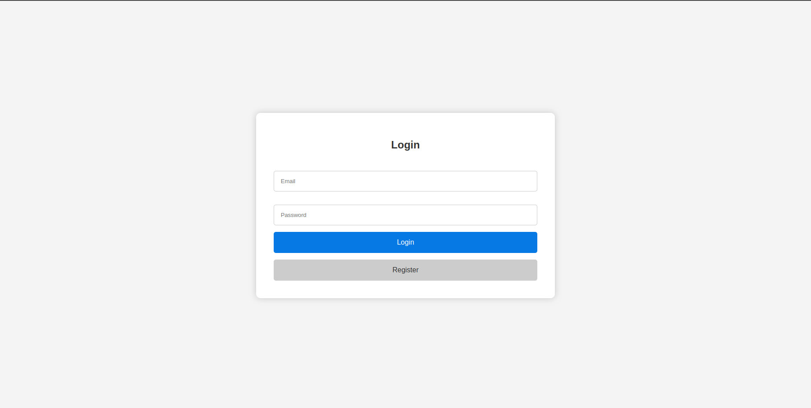
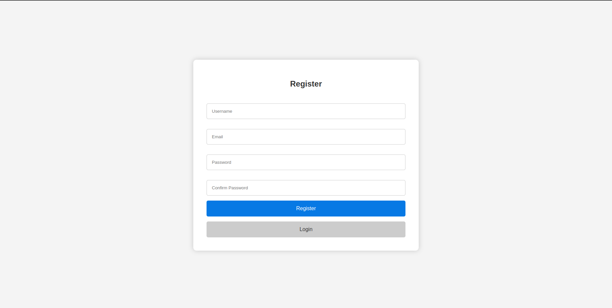
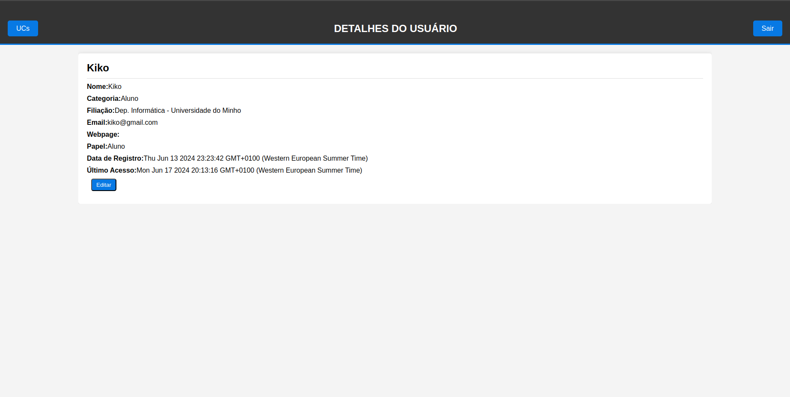
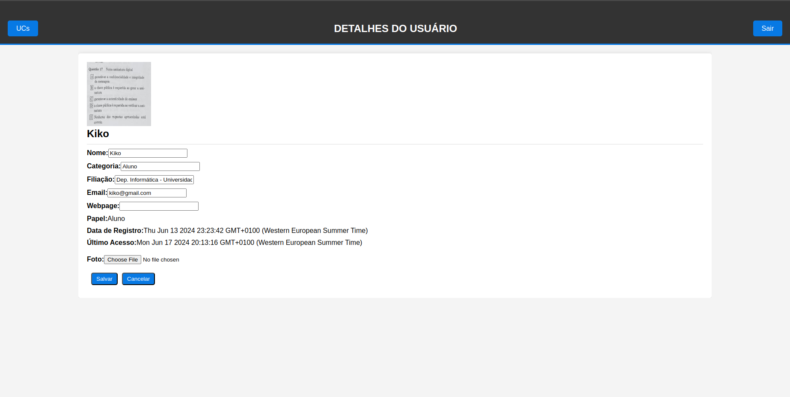
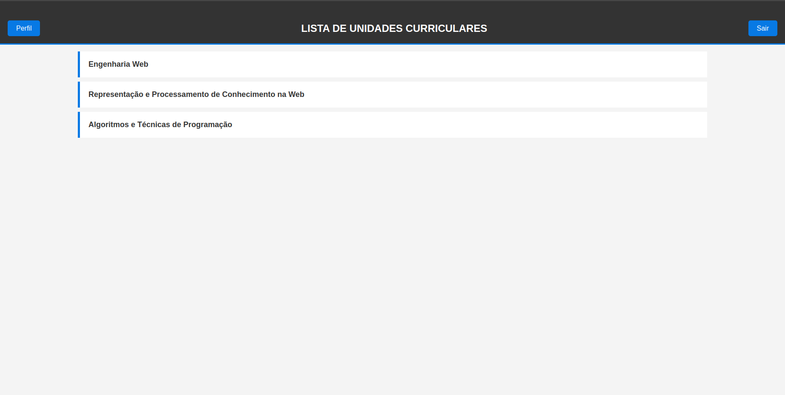
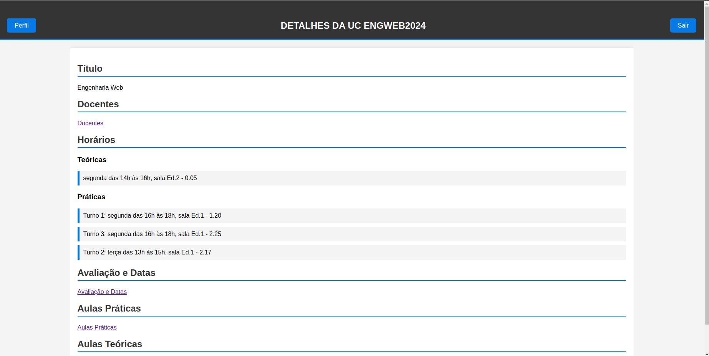
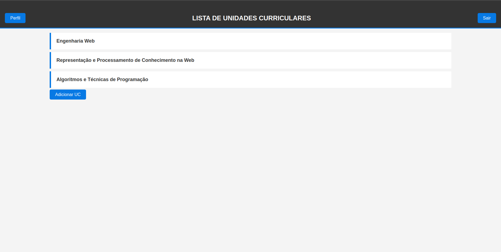
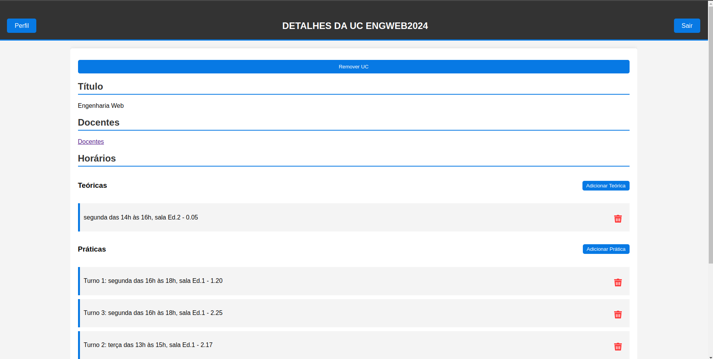
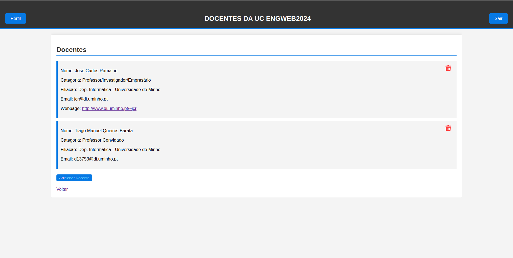
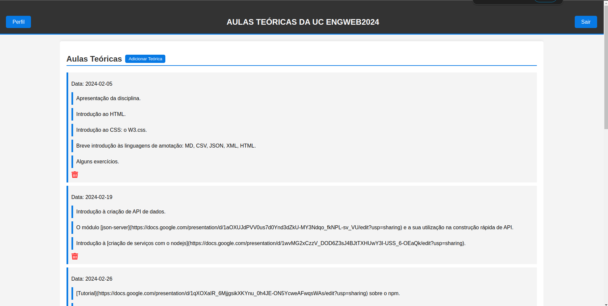
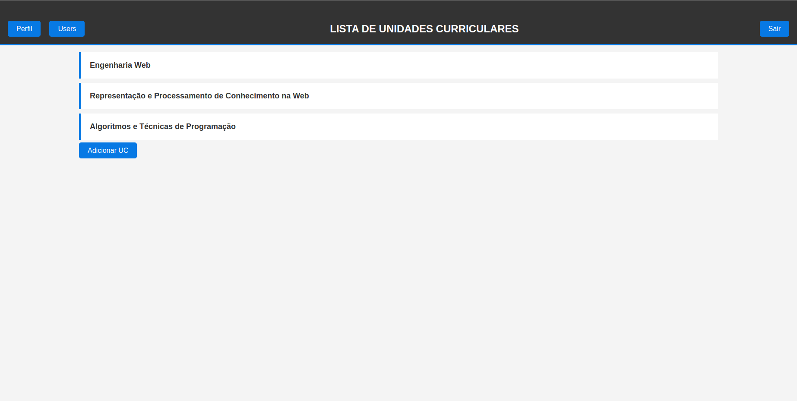
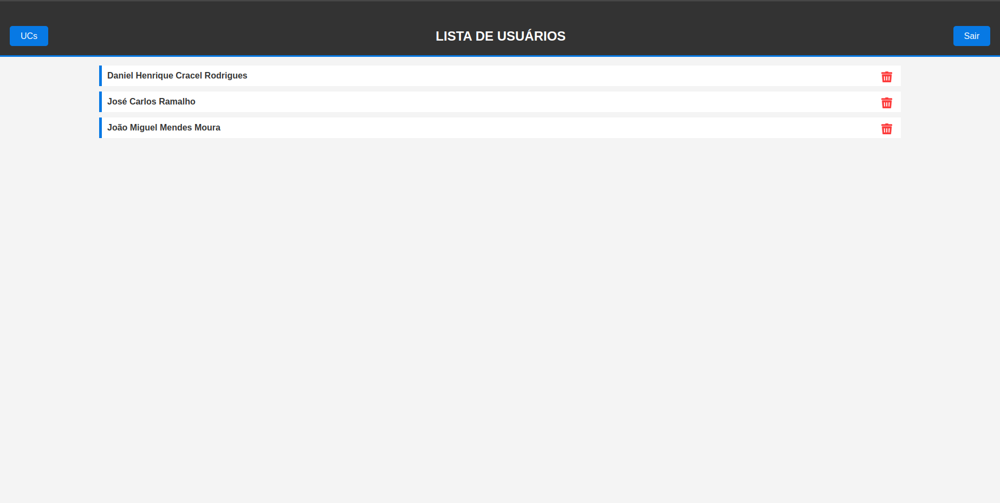
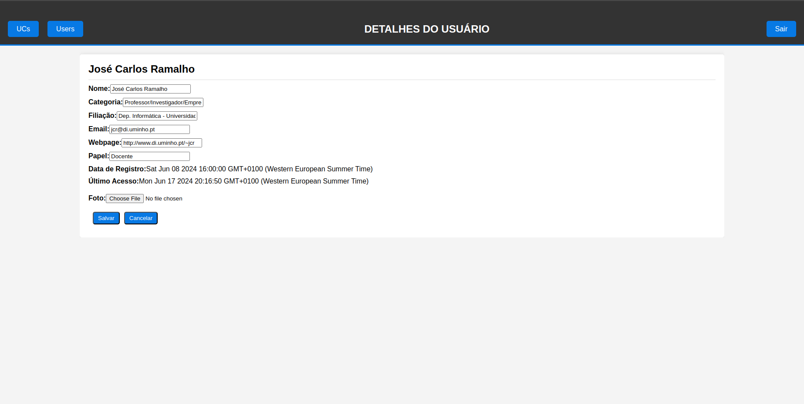

# Modo de funcionamento:

## Num terminal fazer:
1. sudo python3 setup-container.py UCS datasets/ucs.json datasets/users.json
2. sudo docker exec -it trabalho-ew-2024_mongodb_1 bash

## Abrir outro terminal e fazer:
1. npm i
2. npm i mongoose
3. npm start

# Conclusão:

Para concluir, sentimos que temos um website funcional e intuitivo.
Ao longo do desenvolvimento deste projeto, foram atendidos os requisitos mínimos e sentimos que conseguimos implementar ideias que tivemos ao longo do desenvolvimento do website.
Sentimos que com a realização deste projeto, aumentamos o nosso conhecimento de pug bem como de JavaScript.